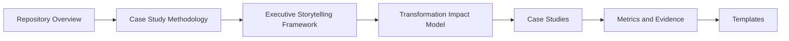

# Content Index

## Purpose

This index organizes the repo into a front door for transformation case studies, impact evidence, and executive storytelling.
Use it to move from the overall case-study method to the exact story or metric artifact you need.
The structure is designed so a reviewer can move from the narrative frame into the metrics and evidence that support it.

## Recommended Reading Path

| Step | Page | Why |
| --- | --- | --- |
| 1 | Repository Overview | Understand the publication model |
| 2 | Case Study Methodology | See how stories are structured |
| 3 | Executive Storytelling Framework | Shape the executive narrative |
| 4 | Transformation Impact Model | Connect change to measured value |
| 5 | Case Studies | Review reusable examples |
| 6 | Metrics, evidence, templates | Package the publication |

## Entry Points

- [Transformation Case Registry](metrics/transformation-case-registry.md)
- [Repository Overview](./repository-overview.md)
- [Case Study Methodology](./case-study-methodology.md)
- [Executive Storytelling Framework](./executive-storytelling-framework.md)
- [Transformation Impact Model](./transformation-impact-model.md)

## Case Studies

- [Multi-Cloud Governance Case Study](../case-studies/multi-cloud-governance-case-study.md)
- [SRE Reliability Case Study](../case-studies/sre-reliability-case-study.md)
- [FinOps Cost Optimization Case Study](../case-studies/finops-cost-optimization-case-study.md)
- [Disaster Recovery Case Study](../case-studies/disaster-recovery-case-study.md)
- [Enterprise Architecture Case Study](../case-studies/enterprise-architecture-case-study.md)

## Metrics and Evidence

- [Business Value Mapping](../metrics/business-value-mapping.md)
- [Impact Metrics Catalog](../metrics/impact-metrics-catalog.md)
- [Evidence Index](../evidence/evidence-index.md)

## Templates

- [Case Study Template](../templates/case-study-template.md)
- [Executive Summary Template](../templates/executive-summary-template.md)
- [Impact Metrics Template](../templates/impact-metrics-template.md)

## References

- [Bibliography](../references/bibliography.md)

## Reading Order

1. Repository overview
2. Case study methodology
3. Executive storytelling framework
4. Transformation impact model
5. Case studies
6. Metrics, evidence, and templates

## Visual Route

## Shared Direction

Use the same section structure as the other core repos so case studies stay reusable and easy to connect across the ecosystem.
Keep each page concise enough to scan and specific enough to support publication-quality output.
If a page does not help prove, compare, or publish the story, move that detail into a more focused case study or metric artifact.

## Shortcut View

| Need | Best Starting Point |
| --- | --- |
| Write a case study | Case Study Template |
| Summarize impact | Impact Metrics Template |
| Write the executive version | Executive Summary Template |
| Connect evidence | Evidence Index |
