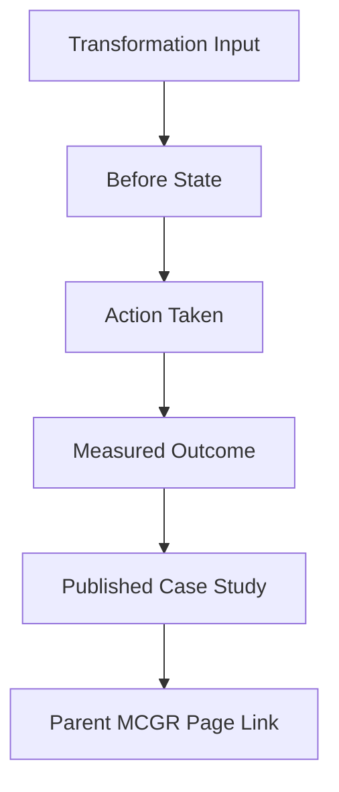

# Repository Overview

## What This Repository Does

This repository turns transformation work into published case-study content that can be reused across the broader ecosystem.
It helps the team turn experience into a repeatable public narrative with evidence behind it.
The goal is to make transformation stories credible, visually scannable, and easy to reuse on the parent MCGR page and related webpages.

## What It Covers

- transformation context
- outcomes and impact
- before / after narrative
- metrics and evidence
- executive summary
- reusable templates

## Who Uses It

- executives
- technology leaders
- architects
- transformation teams
- marketing and public narrative teams

## What Good Looks Like

- stories are anonymized but still specific
- outcomes are measurable
- the narrative explains why the change mattered
- every case can be traced to supporting evidence
- every case has a clear before, after, and lesson learned

## How To Read It

Start with the repository overview, then move into the impact model and methodology.
That sequence keeps the story grounded in measurable outcomes before expanding into the supporting case studies.

## Figure

## Practical Use

Use this repository when you need to communicate transformation value in a way that is both credible and reusable.
It should also be easy to reference from the parent MCGR page so the case-study library is visible as part of the larger ecosystem.

## Outputs

- case study write-ups
- impact metric summaries
- executive summaries
- evidence indexes
